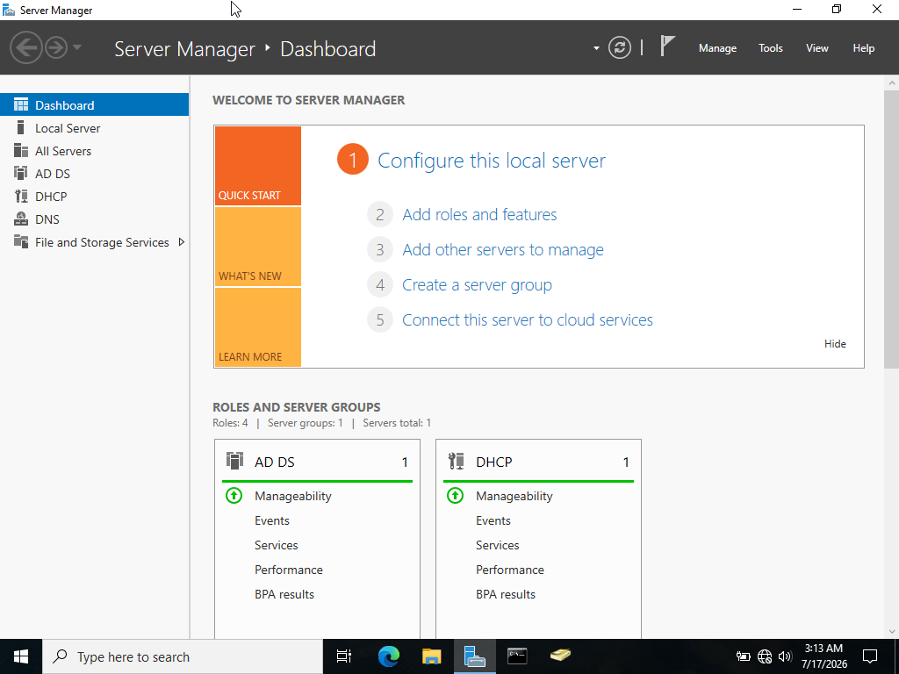
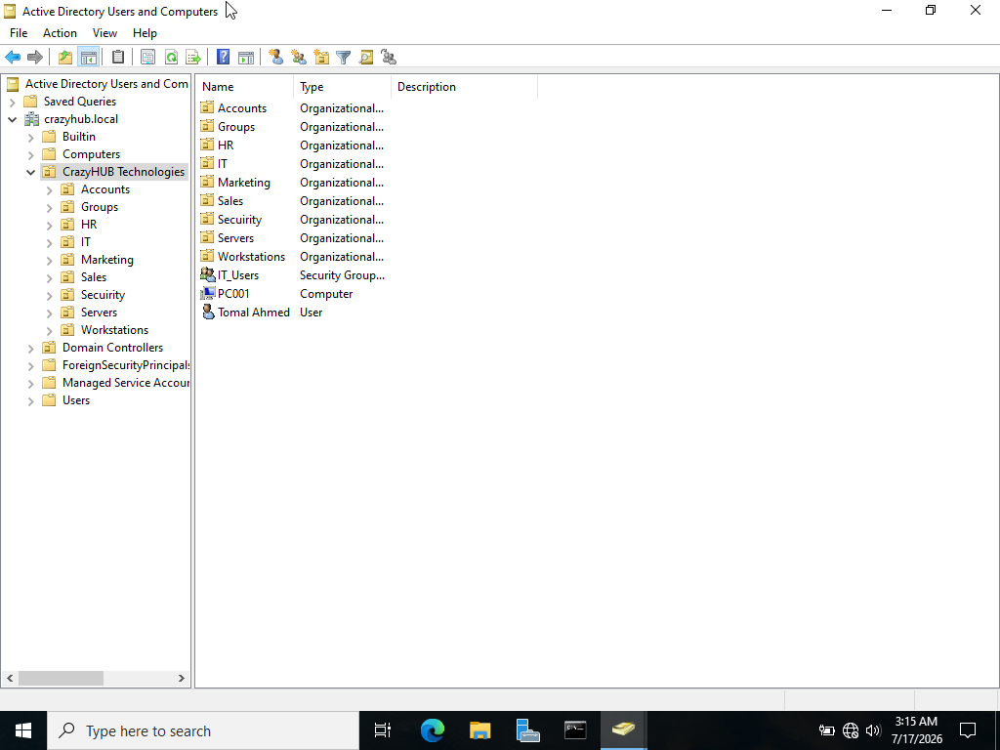
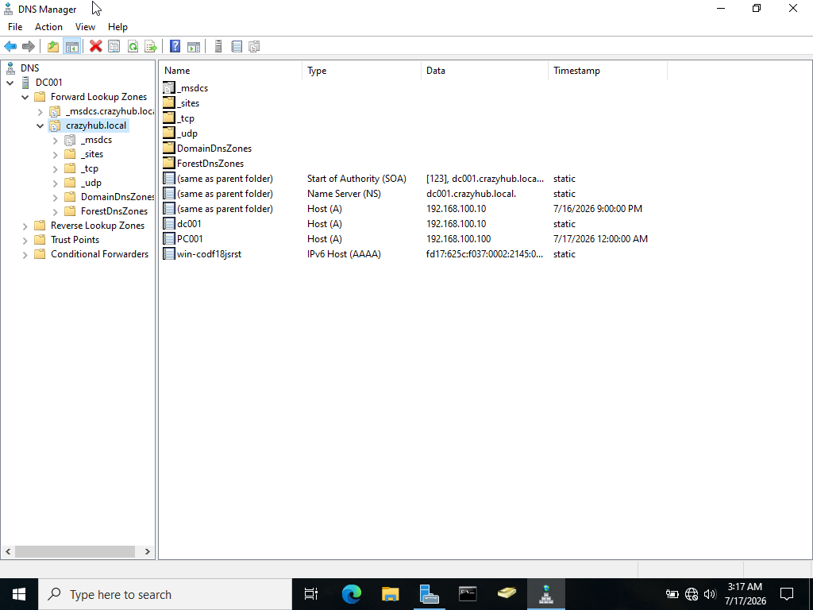
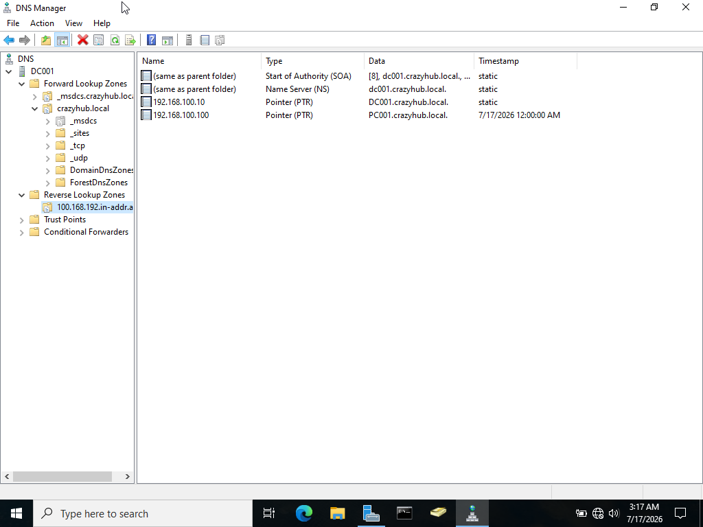
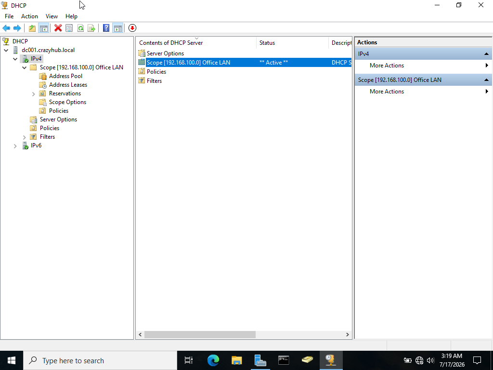
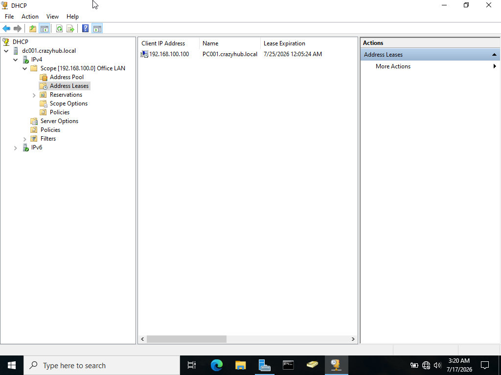
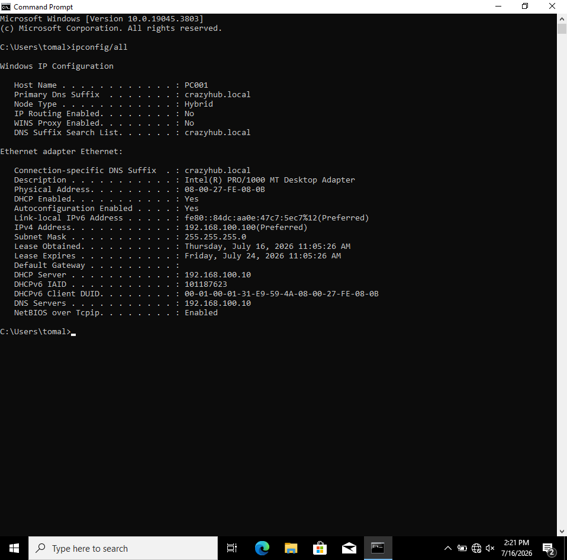
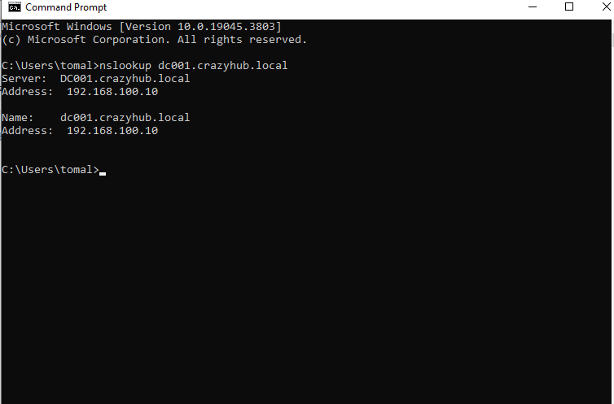
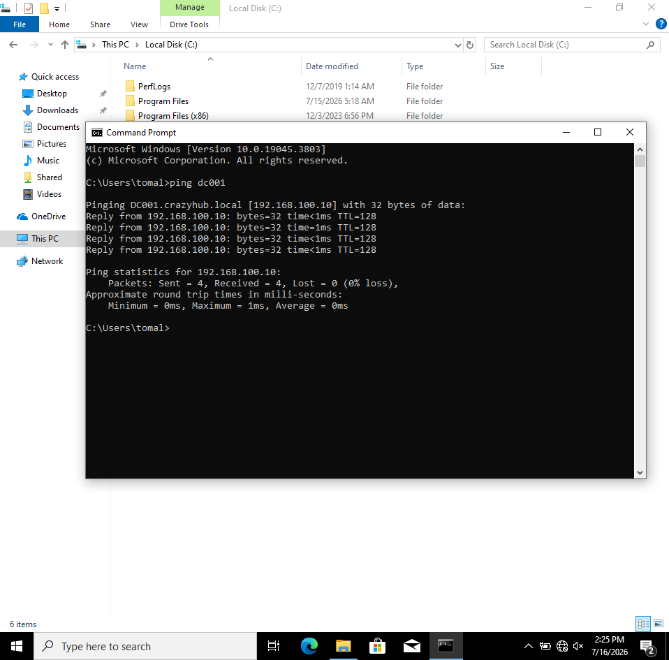
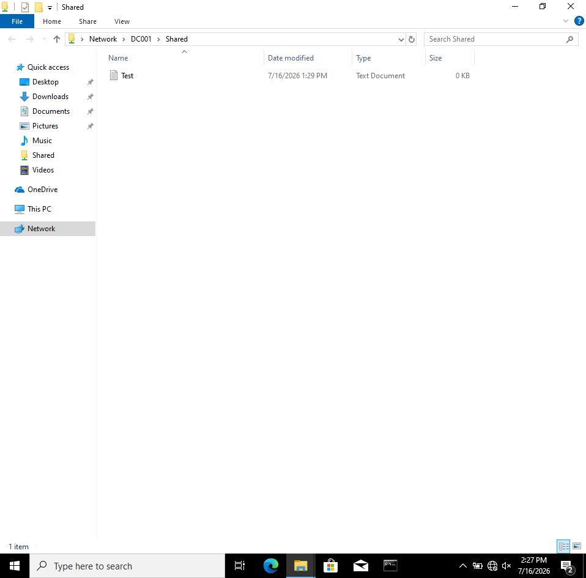

# 🏢 CrazyHub Enterprise Infrastructure – Windows Server 2022 Lab

## 📌 Project Overview

This project demonstrates the deployment and configuration of a Windows Server 2022 enterprise environment in a virtual lab. The objective was to simulate a small business network by implementing core Windows Server services used in real-world organizations.

The environment was built from scratch and includes domain management, centralized authentication, DNS, DHCP, Group Policy, and shared resource management.

---

# 🎯 Project Objectives

* Deploy a Windows Server 2022 environment
* Configure Active Directory Domain Services (AD DS)
* Create and manage a Domain Controller
* Configure DNS and Reverse DNS
* Deploy and configure DHCP
* Create Organizational Units (OU)
* Create Users and Security Groups
* Configure Group Policy Objects (GPO)
* Join a Windows Client to the Domain
* Configure Shared Folder access
* Test enterprise network functionality

---

# 🖥️ Lab Environment

| Component         | Configuration             |
| ----------------- | ------------------------- |
| Windows Server    | Windows Server 2022       |
| Client OS         | Windows 11                |
| Domain Name       | crazyhub.local            |
| Domain Controller | DC001                     |
| Client Computer   | PC001                     |
| Network Type      | Internal Network (LabNet) |

---

# 🚀 Implemented Services

## ✅ Active Directory Domain Services (AD DS)

* Installed Active Directory Domain Services
* Promoted Windows Server to Domain Controller
* Created the **crazyhub.local** domain
* Configured Organizational Units
* Created Domain Users
* Created Security Groups

---

## ✅ DNS Server

Configured:

* Forward Lookup Zone
* Reverse Lookup Zone
* PTR Records
* Name Resolution
* DNS Client Testing

Verified using:

* nslookup
* Ping

---

## ✅ DHCP Server

Configured:

* DHCP Role
* DHCP Authorization
* IPv4 Scope
* Address Pool
* Lease Distribution
* DNS Options
* Gateway Configuration

Client successfully received IP automatically from the DHCP Server.

---

## ✅ Group Policy (GPO)

Configured and tested:

* Command Prompt Restrictions
* Policy Deployment
* Group Policy Updates

---

## ✅ File Sharing

Configured:

* Shared Folder
* NTFS Permissions
* Share Permissions
* Client Access Verification

---

## ✅ Client Configuration

Windows 11 client successfully:

* Joined the Domain
* Received DHCP IP
* Used Domain DNS
* Connected to Shared Resources
* Communicated with Domain Controller

---

# 📷 Project Screenshots

### 1. Windows Server Manager

### 2. Active Directory Users and Computers

### 3. DNS Forward Lookup Zone

### 4. DNS Reverse Lookup Zone

### 5. DHCP Scope

### 6. DHCP Address Lease

### 7. Client IP Configuration

### 8. DNS Resolution

### 9. Domain Authentication

### 10. Shared Folder Access

---

# 🛠️ Technologies Used

* Windows Server 2022
* Windows 11
* Active Directory
* DNS
* DHCP
* Group Policy
* NTFS Permissions
* Shared Folders
* PowerShell
* VirtualBox

---

# 🎓 Skills Gained

Through this project I gained practical experience in:

* Windows Server Administration
* Active Directory Management
* DNS Configuration
* DHCP Deployment
* Domain Controller Administration
* User & Group Management
* Enterprise Network Configuration
* Group Policy Management
* File Sharing
* Enterprise Troubleshooting

---

# 📈 Project Outcome

Successfully designed, deployed, and validated a complete Windows Server 2022 enterprise lab environment featuring Active Directory, DNS, DHCP, Group Policy, Domain Services, and centralized file sharing. The project simulates a real-world small office infrastructure and demonstrates hands-on experience in Windows Server administration and enterprise network management.

---

## 👨‍💻 Author

**Tanjim Ahmed Tomal**

Computer Engineering Graduate

Aspiring System Administrator | Network Engineer | IT Support Specialist
